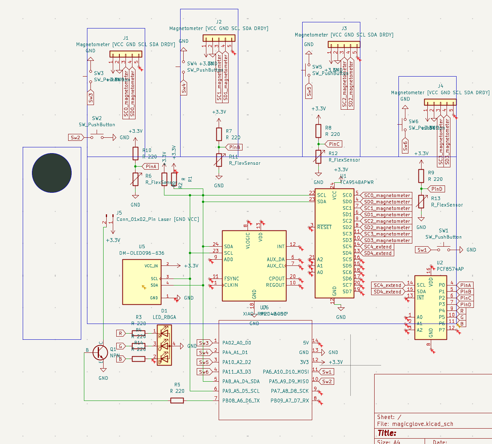

# Magic Glove

Hello! My name is Dristi Roy and here is my submission for a grant to create and program my magic glove. I plan to program this for interactive signage projects such as a collaboration with my projector. Ideally will be granted from 4pts-6pts

This glove features 4 flex sensors, 4 magnetometers, capacitive pads attached to each finger and a magnet on the thumb, one primary MPU6050 to function as a cursor, an oled to display sensor data, and optionally programmable switches+leds.

How will this work on a glove? The answer is incredibly thin wires as well as conductive thread that will be sewn into the cloth.

### Schematic

### CAD Concept

### B.O.M.
4x Magnetometers
4x Flex Sensors
1x Disk Magnet Tiny
1x Battery Pack
1x MPU 6050
1x RP2040 XIAO
1x TCU Multiplexer
1x PF Multiplexer
1x Spool of wire